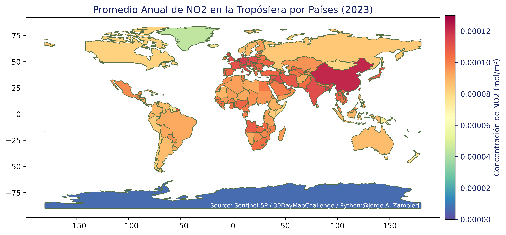
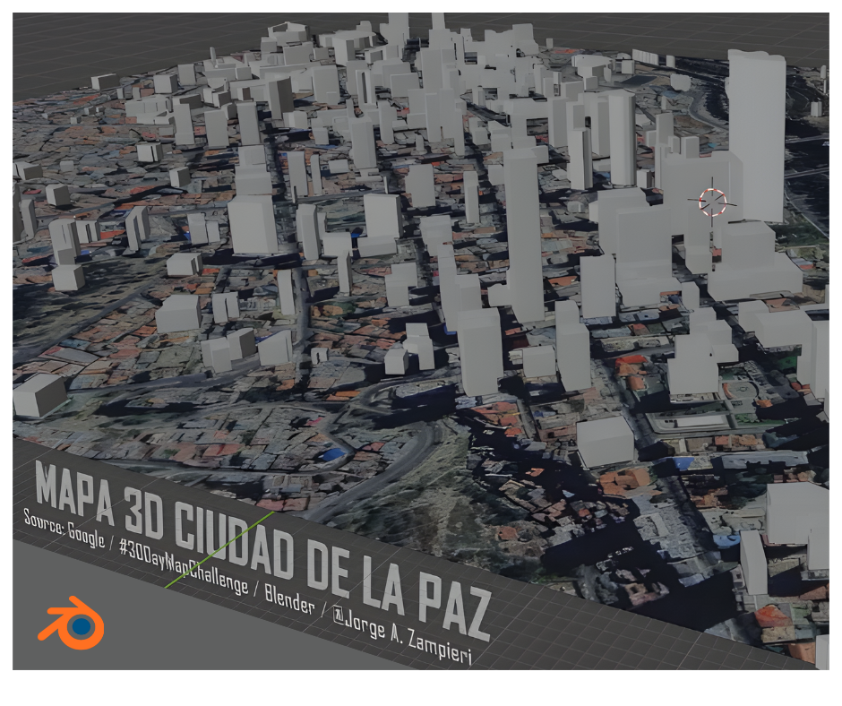

# 30DayMapChallenge 2024

En este repositorio encontrarás todos los recursos y códigos utilizado en la creación de los mapas de la versión 2024 del #30DayMapChallenge

## Herramientas y Programas empleados
- [QGIS](https://www.qgis.org/)
- [Blnder](https://www.blender.org/)
- [Visual Studio Code](https://code.visualstudio.com/)
- [Python](https://www.python.org/)
- [Colab](https://colab.research.google.com/)

## Collage 

## Day 1 - Point

#### Estaciones de Peajes en Bolivia
El mapa muestra las estaciones de peajes por cada departamento de Bolivia, estos datos fueron obtenidos del portal web: [GeoBolivia](https://geo.gob.bo/catalogue/#/datasets)

## Day 2 - Lines

### Red Hídrica Beni-Bolivia
Se representan todos los ríos primarios y secundarios del departamento de Beni en Bolivia, estos datos fueron obtenidos del portal web: [GeoBolivia](https://geo.gob.bo/catalogue/#/datasets)

## Day 3 - Polygons

### Vegetación urbana por manzanos

Mediante la obtención del NDVI de una Imagen Satelital se muestra por manzanos en la ciudad de santa Cruz de la Sierra la influencia que tiene la cobertura vegetal.

## Day 4 - Hexagons

### Altura del Dosel 

El Mapa muestra la altura del dosel global con una resolución de 1 metro, de los arboles categorizados por hexágonos de 8km de diámetro en todo el departamento de Santa Cruz en Bolivia, estos datos fueron porporcionados por Meta y el World Resources Institute.

## Day 5 - A Journey

### Un Viaje en el PN y ANMI Amboró

Uno de mis pequeños viajes como voluntario en el Programa de Conservación del Águila Arpía al interior del Parque Nacional y Área de Manejo Integrado Amboró

## Day 6 - Raster

### Conatminación por incendios en Ámerica del Sur

La figura muestra la contaminación mediante el AOD de las imagenes de level3 de NOAA20-VIIRS producto de los incendios forestales en América del Sur durante uno de los días de septiembre de 2024.

## Day 7 - Vintage Style

### Centro de la Ciudad de la Paz - Bolivia

Se visualiza de manera antigua el centro de la ciudad de La Paz en Boolivia, el mapa tiene como centro a la plaza del estudiante. Para la creación de este mapa se utilizó el paquete de python prettymaps crado por @Marceloprates, para más modelos revisa este [Repositorio](https://github.com/marceloprates/prettymaps)

## Day 8 - Data: HDX

### Densidad de Población 

Para este mapa, se obtuvieron los datos de [Data Humanitarian: HDX](https://data.humdata.org/dataset/bahamas-high-resolution-population-density-maps-demographic-estimates#). Como área de estudio se consideró algunos de los barrios de Miami.

## Day 9 - IA Only

### América del Sur 

Le planteé a la IA como sería America del Sur si no se aplican políticas efectivas de Conservación de Bosques, cuerpos de aguas y biodiversidad, en el futuro, y estas dos IA ChatGPT y Gencraft, mostraron los siguientes resultados.

|  |  |
|-----------------------------------|-----------------------------------|
| imágen generada por la IA ChatGPT        | Imágen generada por la IA Gencraft         |

## Day 10 - Pen & Paper

### Mi Bolivia

Aunque no tengo afinidad para crear dibujos, hice mi mejor esfuerzo para mostrar a mi país Bolivia.

## Day 11 - Arctic

### Arctic

Avistamiento del  Canis lupus subsp. arctos Pocock, (1935) en el ARCTIC.

## Day 12 - Time and Space
### Cuenca Baja - Río Maniqui

Comportamiento de la cuenca baja del Río Maniqui en Bolivia

## Day 13 - A new tool

### Mapa de Edificios de Rumania

Usando una nueva herramienta como Blender, creeé este mapa donde se visualiza los edificios de Rumania

## Day 14 - A World Map

### Promedio Anual de NO2 por paises (2023)

Visualización de la concentración promedio anual de Dióxido de Nitrogeno (NO2), para esto empleé los datos de Sentinel-5P de Copernicus.

## Day 15 - DATA: my Data

### Mis Rutas de la adolescencia

En esta ocasión proyecté las rutas que más recorría durante mis estudios de colegio en un pequeño pueblo en la Amazonía Boliviana,

## Day 16 - Choropleth

### Biomasa Total Anual

En este mapa muestro la distribución de la Biomasa Total Anual por Municipios en Bolivia, los datos fueron obtenidos del portal [WaPor de la FAO](https://data.apps.fao.org/wapor/?lang=es).

## Day 17 - Collaborative Map

En el día 17, decidí pedirle la colaboración a la IA [ChatGPT](https://chatgpt.com/), para elaborar un mapa donde se muestre la distribución del NO2 en la provincia Andrés Ibañez en Santa Cruz

## Day 18 - 3D

La imagen muestra una parte de la Ciudad de La Paz con el modelo 3D realizado en Blender.

## Day 19 - Typography

la imagen visualiza a Sudamerica con estilo tipográfico, esto se logra gracias a un plugin de QGIS.

## Day 20 - Data: OpenStreetMap

6 Barrios de Venezia en Italia, para esto empleé el paquete de python prettymaps.

## Day 21 - Conflict

Evolución de la violencia organizada desde 1989 hasta el 2023 en África.

## Day 22 - 2 Colours

Sitios Ramsar en Bolivia.

## Day 23 - Memory

Recordando mi visita a la tirolesa más larga de Bolivia.

## Day 24 - Only Circular Shapes

Visualizando la superficie de los municipios de Bolivia con una perspectiva diferente.

## Day 25 - Heat

Visualizando la temperatura nocturna en America del Sur.

## Day 26 - Map Projection

Explorando las diferentes proyecciones.

## Day 27 - Micromapping

Mapeando los predios de la Universidad Autónoma Gabriel René Moreno UAGRM en Bolivia.

## Day 28 - The Blue Planet

Visualizando un Modelo de circulación general oceánica.

## Day 29 - Data: Overture

Visualizando una parte del centro de la Ciudad de Cochabamba en Bolivia (Plaza 14 de septiembre)

## Day 30 - The Final Map

Altura de la copa de los árboles, de acuerdo a la Ley Municipal N°210 de Santa Cruz de la Sierra..

### Gracias por ver hasta el final
### By: @Jorge A. Zampieri 